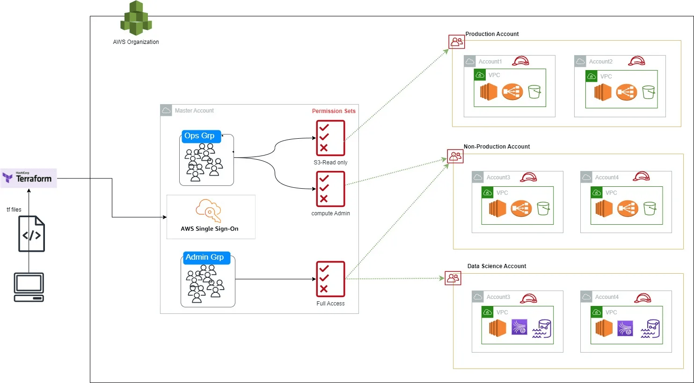

# Migration Plan to Modernize AWS Infrastructure

Migrating from a monolithic architecture to a modern, highly-available infrastructure is a significant undertaking that requires careful planning and execution. With such a significant undertaking, it's important that all members are involved in the process in different degrees.

Actively participatation of the developmet team in architectural decisions is crucial in undertaking a wholesome, empowering and efficient process.

The objective is to design and implement a migration plan to move from a monolithic AWS infrastructure to your improved architecture.

We first begin with a simple task of producing efficient minimal container images.

## Task 1: Quick Optimisation Challenge

```
# Use a minimal RUST base image to reduce the image size
FROM rust:1.69-slim-bullseye as builder

WORKDIR /project

RUN apt-get update
RUN apt-get install -y --no-install-recommends \
    build-essential \
    curl

COPY Cargo.toml Cargo.lock ./

# Run dependencies
RUN cargo fetch

# Copy source files and build project
COPY ./src ./src
RUN cargo build --release

# Use a minimal image for the final stage
FROM debian:buster-slim

# Copy the built binary from the builder stage
COPY --from=builder /project/target/release/myapp /usr/local/bin/myapp

# Set the entrypoint for the application
CMD ["myapp"]

```

You can find the list of available packages using the following commands:
- https://stackoverflow.com/questions/57803595/how-do-i-list-all-applications-that-are-contained-in-a-docker-container 

## Task 2: Improve The Architecture

This is where we focus on moving from a Monolithic architecture to a modern, highly-available infrastructure. The task will be broken down into a number of steps which I feel are important. The order of the steps can be flexible.

### Objective:
Design and implement a migration plan to transition the existing AWS infrastructure to a more advanced, highly available architecture.

This project assumes the current infrastructure is as follows.

### Current Infrastructure
- VPC with two public subnets across different availability zones
- EC2 instances running the applications
- Elastic Load Balancer for traffic distribution
- Security Group allowing HTTP traffic
- Simple deployment using user data script on EC2 instances

### Proposed Architecture Improvements

There are two main architectural computational choices available in AWS which meet the requirements.
- Microservics Arhitecture: where we break down the monolithic into smaller, indepedent services.
- Severlesss Computation Arhitecture: Leveraging the use of AWS Managed servicse like Lambda functions, API Gateways etc that can be event-driven.

In large scale project as this, there is no one simple answer, and the right tool whether microserves or serverless will depend on each scaenario. All services mentioned below work for both microservices and serverless architecture unless stated otherwise.

1. VPC and Networking improvements
- Private and Public Subnets: Divide the VPC into private and public subnets across multiple Availability Zones (AZs).
- NAT Gateways: Enable instances in private subnets to access the internet securely whilst preventing inbound traffic.
- Route Tables: Configure custom route tables for network traffic control.

2. High Availability and Scalability
- Multi AZ Deployment: Distribute resources across at least mulitple AZs for fault tolerance.
- Auto Scaling Groups (ASGs): Automatically adjust the number of EC2 instances based on load/demand
- Application Load Balancer (ALB): Replace ELB with ALB for advanced routing features.

3. Refactor Applications
- Identify boundaries: Refactor applications based on logical boundaries.
- Identify value: Categories services which add value to the business.

4. Containerise and Orchestrate (microservice)
- Containerise applications: Containerise application for consistency and scalability across enviromnents.
- Elastic Kubernetes Servics: Make use of EKS for container orchestration due to it's flexibility, support and vast capabilities.

5. Serverlesss Computation (serverless)
- AWS Lambda: migrate resources that are event-driven and have a run-time of less than 15 minutes without the need of state managenet
- Step functions: If state management is required, use step functions alongside AWS Lambda
- API Gateway: To expose AWS API's e.g. AWS Lambda via RESTful API

6. Infrastructure as Code (IaC)
- Terraform / Terragrunt: Import all manually deployed resources to terraform state and create all new resources using terraform.
- Version Control: Store IaC manifest in a Git repository.
- Lock Control: Store terraform state lock in DynamoDB
- Modular templates: Create or make use of reusable terraform modules for common infrastructure resources.

7. Continous Integration and Contineous Deployment (CI/CD)
- Pipleline: Setup the pipeline using: Github Actions OR CircleCI for CI and ArgoCD for CD.
- Testing: Run through application unit testing and infrastructure linting. 
- Blue/green deployment: consider how you can implement blue/green deployment to minimuse downtime during deployment
- Backup: Policies and processses for Disaster Recovery.

8. Security
- IAM Roles and Policies: Fine-grained access control for resources and IAM identities.
- Security Groups and Network ACL (firewall): limit access to inbound and outbound traffic rules in resources
- AWS Web Application Firewall (WAF): Add WAF after load balancer to protect against commonly uses web exploitations.
- Encryption: Encrypt resourcse at rest (KMS, S3, RDS, EC2) and during transit (HTTPS)
- VPN: Users connect to AWS and AWS resources through VPN (fixed IP addresses)
- AWS IAM Identity Center (previously Single Sign-oN SSO) for authentication.


9. Cost Optimisation
- VM cost plan: buy Reserved Instances (RI) for resources we know we will need and/or Saving Plans to commit to spending $$ on resources for t time.
- Right-sizing resources: Regularly analyise and adjust resource size
- Create Prometheus and Graphana dashboard for visualising resource utilisaton.

### Migration Procedure

#### Stage 1: Planning and Preparation

1. Team Alignment
- Arrange meetings with all stackholders align on the goals, gather requirements and concerns.
- Demonstrate what success looks like.

2. Workshops
- Evaluate teams level of understanding in IaC, containerisation and EKS
- Conduct training sessions (inidivuals), workshops (groups) and documentations.

3. Resource Inventory
- Catelog all existing AWS resources and their configurations
- Catelog resource dependenceies and data flows between services.

#### Stage 2: Infrastructure setup

1. Implement IaC
- Choose tool based on teams skillset, in this example it's terraform
- Set up Git repository, S3 bucket for state control, and DynamoDB for state lock
- Structure the networking: VPC, Subnets, route teables, security groups.

2. Network Configuration
- Structure the networking: VPC, Subnets, route teables, security groups.
- Create and configure NAT Gateway, Internet Gateway and, Transit Gateway for multi-account setup.

3. Security
- Create separate IAM roles for developers, engineers, billing stackholders and admin
- Ensure resources are encrypted at rest using KMS and in transit
- Implement SSO for authentication into the infrastructure by users, leveraging existing (Microsoft) Active Directory or create new in AWS.
- Consider 3rd party monitoring tools including a volunerability analysis of container images.
- Restrict how permissions can be allocated to users. Team lead or managers can request access to individuals.
- Create a VPN if one does not exist for users to tunnel through in order to access AWS and AWS resources. VPN's provided fixed IP address.

#### Stage 3: Migrating applications

1. Containerisation
- Containerise applications using Docker
- Store the container images in Amazon Elastic Container Rigestry (ECR)
- Consider a single repository containing all images for a single source of truth.

2. Deploy EKS
- Create EKS using choosen IaC i.e. terraform
- Create necessary plugins for EKS to interact with terraform

4. Configure access to the public internet
- Deploy an Application load balancer in the public subnet
- Ensure there is access to the internet and from the internet - correctly configure listeners and target groups

5. Validate database during application migration
- Ensure the applications running in EKS are able to reach the database
- Ensure database credentials and securely stored in AWS secret manager.

6. Deploy Karpenter (instead of using Auto scaling)
- Karpenter has the ability to shift between instance size, choosing the optimum instance for EKS requirements
- Karpenter shines most in GPU intensive tasks.

#### Stage 4: Implementing CICD pipeline

1. Configure pipline for the infrastructure
- Setup a GitHub action pipeline or atlantis for the terraform manifest infrastructure

2. Automate IaC linting and validation deployment
- Implmenting automated linting.
- Segregate environments by state and accounts
- Ensure approval is required before any merges to the main branch

3. Configure pipline for the Kubernetes manifest application
- Configure CI to be done via Github Actions or CircleCI
- Ensure all users who have access to the repository have access to the Github Action run or CircleCI
- If build is successful in CircleCI and Pull Request (PR) is approved, deploy to environment using ArgoCD.

4. Automate Kubernetes manifest application deployment
- Create an manifest validation step (request and limits check)

5. Configure pipeline for Docker images to ECR deployment
- Automate checks with 3rd party for critical volunerability checks
- Validate docker image
- (optional) make use of secured golden base image for a more secure architecture

#### Stage 5: Monitoring and Optmisation

1. Monitoring setup
- Install Cloudwatch agents on EKS EC2's for more rebous metrics like memory usage
- Configure Cloudwatch alarms (and optionally Cloudwatch dashboard) 
- A better alternative to cloudwatch dashboard is Grafana dashboards

2. Logging
- Set up log aggregation using Cloudwatch agent and send logs to Grafana Loki
- Logs can also be viewed in ELK stack i.e. Kibana
- Ensure necessary logs are retained for policy compliance.

3. Performance monitoring
- Monitor resource metrics on Grafana and identify bottlenecks
- Fine tune specified resource and limits on Kubernetes manifest to aid in Karpenter (autoscaler)

#### Stage 6: Shift and Validation

1. DNS Update
- Update Route 53 DNS records to point to the new Application Load Balancer (ALB) 

2. Testing
- Validate functionality of each server with it's appropriate team
- Monitor for any issues
- Conduct load testing with the QA team if one is available.
- Ensure sufficient time is given to the new architect to check for any issues

3. Decommision the monolithic infrastructure
- After successful validation, decommissioning the old EC2 instance and their associated Elastic Load Balancer (ELB).
- Remove any other unsed resources.

### Diagrams


- (Infrastructure Deployment)[https://miro.com/welcomeonboard/V0kzZkZ4Z1YyZU1pSGFkaGhOZ20xaVIyYWZDY3dDaFNFYWFyYU1TTWxTcjFQcXhPaWYzUVdYbmlJV2h6aXlzdHwzNDU4NzY0NTMzNTA5OTMyOTgxfDI=?share_link_id=420350303101]

- (Kubernetes Application Deployment)[https://miro.com/welcomeonboard/V0kzZkZ4Z1YyZU1pSGFkaGhOZ20xaVIyYWZDY3dDaFNFYWFyYU1TTWxTcjFQcXhPaWYzUVdYbmlJV2h6aXlzdHwzNDU4NzY0NTMzNTA5OTMyOTgxfDI=?share_link_id=145558912219]

- (CICD Codepipeline)[https://docs.aws.amazon.com/prescriptive-guidance/latest/patterns/create-a-ci-cd-pipeline-to-validate-terraform-configurations-by-using-aws-codepipeline.html]



AWS Single Sign-On (AWS SSO) is now AWS IAM Identity Center
- IAM identity: manages identity federations (Authenticating users from multiple systems Google, Okta etc) within AWS
- (Authentication)[https://medium.com/cloud-native-daily/automate-aws-sso-using-terraform-2f219a45c16f]
- (Authentication third party)[https://practicalcloud.net/comprehensive-guide-to-aws-single-sign-on-sso-centralized-access-and-permission-management-across-multiple-aws-accounts/]

For more detailed reading, please use the following resources:
- (Moving fom Monolithic to Microservice Architecture)[https://aws.amazon.com/compare/the-difference-between-monolithic-and-microservices-architecture/]
- https://sigma.software/about/media/migrating-monolith-microservices-step-step-guide